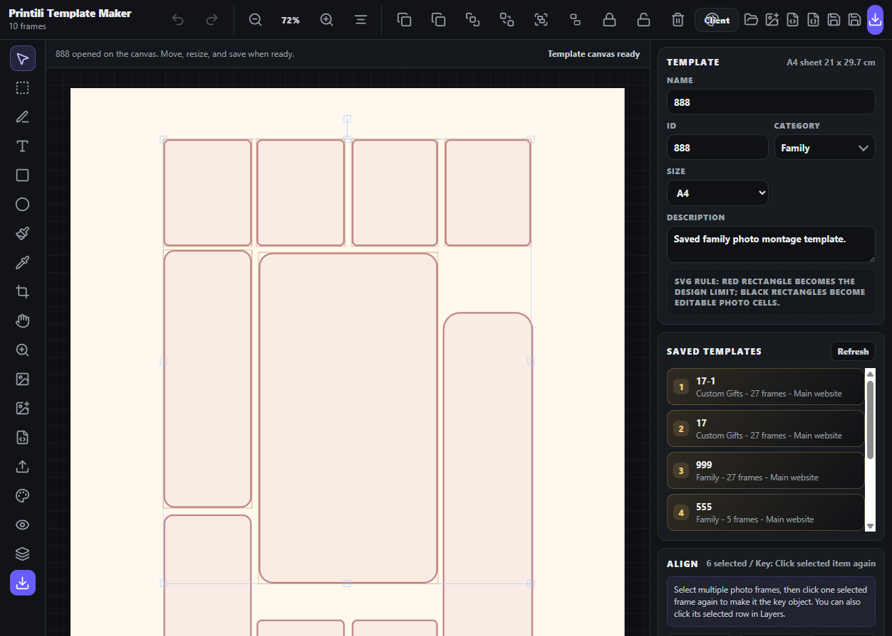

# Design Research: Printili Template Editor UX

## TL;DR

Printili is moving in the right direction by combining extractor, maker, public catalog, and admin controls. The biggest gap against Canva, Shutterfly, Mixbook, Adobe Express, and Figma is not raw editing power; it is guided confidence: smart auto-layout, visible quality checks, stronger customer preview, and a clearer production handoff.

## Current State

The Template Maker now has a precision Align panel with key-object selection, spacing, and match-size tools, plus a safer layer-list way to pick the key frame.

## Evidence Notes

1. Adobe Illustrator's official workflow selects multiple objects, clicks one selected object again to make it the key object, then aligns or distributes relative to that key object. It also supports exact distribute spacing values.
2. Figma's official alignment docs emphasize right-sidebar alignment, equal spacing, tidy-up logic, and editable spacing values after arrangement.
3. Canva competes with huge flexible template inventory, drag-and-drop simplicity, AI tools, image enhancements, real-time collaboration, and print/web export.
4. Shutterfly competes with AI autofill, professional designer help, caption assistance, broad style/product options, and quality/finish positioning.
5. Mixbook competes with AI Memories / Auto-Create, recommended layouts, photo grouping, and an easy story-building path.
6. Adobe Express competes with fast collage creation, Adobe Stock/templates, effects, remove background, animations, and easy conversion of a design into a reusable template.

## Next Recommendations

1. Add customer-side smart crop and face-aware fit before checkout.
2. Add template quality scoring in admin: low-resolution warning, empty slot warning, bleed/safe-margin warning.
3. Add auto-layout assist: select photos, choose mood/category, then suggest a template or generate a balanced layout.
4. Add a public template filter system for occasion, photo count, format, price, and delivery type.
5. Add side-by-side customer preview: screen preview plus print-safe PDF preview.
6. Add template version history and duplicate-as-new in Template Maker.
7. Add undo/redo history to Template Maker before more destructive editing tools.
8. Add production dashboard states: paid, print-ready, exported, printed, packed, delivered.
9. Add social proof on public pages: reviews, real examples, delivery guarantees, and quality materials.
10. Add guided mobile upload flow with progress, reorder, crop status, and missing-photo reminders.

## Sources

- Adobe Illustrator align to key object: https://helpx.adobe.com/ie/illustrator/desktop/manage-objects/arrange-objects/align-and-distribute-objects.html
- Adobe Illustrator exact distribute spacing: https://helpx.adobe.com/ie/illustrator/desktop/manage-objects/arrange-objects/distribute-objects-by-specific-distances.html
- Figma alignment/distribution/tidy up: https://help.figma.com/hc/en-us/articles/360039956914-Adjust-alignment-rotation-position-and-dimensions
- Canva photo collage maker: https://www.canva.com/create/photo-collages/
- Shutterfly photo books: https://www.shutterfly.com/photo-books/
- Shutterfly personalization help: https://support.shutterfly.com/s/article/personalizing-a-photo-book
- Mixbook app listing: https://apps.apple.com/us/app/mixbook-photo-book-creator/id1562974920
- Adobe Express photo collage maker: https://www.adobe.com/express/create/photo-collage
